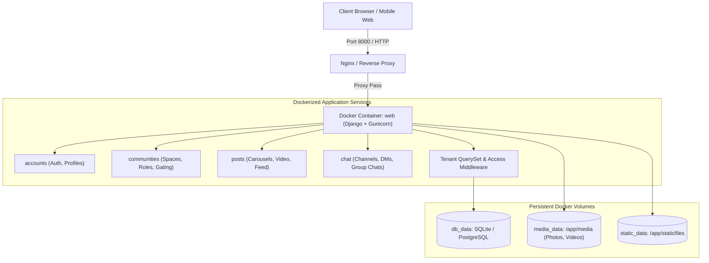
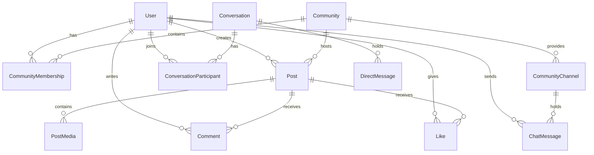

# Community Sanctuary Platform: System Architecture & Design Specification

**Document Version:** 1.0.0  
**Date:** 2026-09-26  
**Status:** Approved for Implementation Planning  
**Target Stack:** Python 3.12+, Django 6.1+, PostgreSQL / SQLite, Docker, Docker Compose, Modern Vanilla JS / CSS3

---

## 1. Executive Summary & Vision

The **Community Sanctuary Platform** is a secure, privacy-first, multi-tenant community network. It bridges the intimate visual feed mechanics of **Instagram** (multi-media carousels, custom video playback, likes, comments) with the structured spaces of **Discord** (community hubs, multi-channel discussions) and the independence of **WhatsApp** (standalone 1-on-1 direct messaging and personal friend group chats).

### Core Problem Solved
Traditional public social platforms expose users to public scrutiny, algorithm-driven toxicity, cross-context data leaks, and widespread misinformation/hoaxes. This platform provides:
1. **Grassroots Digital Sanctuaries:** Anyone can spin up a community server for their college batch, interest group, art collective, or support circle.
2. **Strict Data Isolation:** Communities are walled. Content shared inside a private community can never bleed into other communities or the public web.
3. **Dual Social Architecture:**
   - **Community Hubs:** Public/Private spaces with rule charters, channel-based chats, member join approval, and admin take-down powers.
   - **Personal Socializing:** Standalone username-based DMs and independent personal group chats completely unlinked from any community server.
4. **Organic Information Integrity:** Misinformation and hoaxes are challenged openly in peer comment threads and regulated via instant community admin take-down actions.

---

## 2. Docker & Deployment Architecture

The platform is designed to be fully containerized for both local development, viva practical demonstrations, and self-hosted college/enterprise deployments.



### 2.1 Dockerfile Specification
* **Base Image:** `python:3.12-slim-bookworm`
* **System Packages:** `ffmpeg` (for video metadata & processing), `build-essential`, `libpq-dev` (if PostgreSQL is used).
* **Workdir:** `/app`
* **Commands:** Copies `requirements.txt`, installs pip dependencies, copies codebase, exposes port `8000`, runs database migrations, and boots Gunicorn/Daphne.

### 2.2 `docker-compose.yml` Specification
* **`web` Service:**
  * Build context: `.`
  * Ports: `"8000:8000"`
  * Environment variables: `SECRET_KEY`, `DEBUG=False`, `ALLOWED_HOSTS=*`, `DATABASE_URL`
  * Volumes:
    * `db_volume:/app/data` (database persistence)
    * `media_volume:/app/media` (user uploaded photos and videos persistence)
    * `static_volume:/app/static`

---

## 3. Database Schema & Data Models



### 3.1 `communities` App

#### `Community` Model
* `id`: UUID (Primary Key, prevents sequential enumeration attacks).
* `name`: CharField(max_length=100) — Display name.
* `slug`: SlugField(unique=True) — Clean URL handle (e.g. `/c/campus-devs/`).
* `description`: TextField(blank=True) — Community bio/purpose.
* `rules`: TextField(blank=True) — Community charter, values, and guidelines.
* `privacy`: CharField(choices=[('PUBLIC', 'Public'), ('PRIVATE', 'Private')], default='PUBLIC').
* `avatar`: ImageField(upload_to='communities/avatars/', blank=True, null=True).
* `banner`: ImageField(upload_to='communities/banners/', blank=True, null=True).
* `creator`: ForeignKey(User, on_delete=models.CASCADE, related_name='created_communities').
* `created_at`: DateTimeField(auto_now_add=True).

#### `CommunityMembership` Model
* `community`: ForeignKey(Community, on_delete=models.CASCADE, related_name='memberships').
* `user`: ForeignKey(User, on_delete=models.CASCADE, related_name='community_memberships').
* `role`: CharField(choices=[('ADMIN', 'Admin'), ('MODERATOR', 'Moderator'), ('MEMBER', 'Member')], default='MEMBER').
* `status`: CharField(choices=[('APPROVED', 'Approved'), ('PENDING', 'Pending Request'), ('REJECTED', 'Rejected'), ('BANNED', 'Banned')], default='APPROVED').
* `created_at`: DateTimeField(auto_now_add=True).
* `unique_together`: `('community', 'user')`

#### `CommunityChannel` Model (Discord-Style Sub-Groups)
* `community`: ForeignKey(Community, on_delete=models.CASCADE, related_name='channels').
* `name`: CharField(max_length=50) — (e.g. `general`, `resources`, `memes`, `announcements`).
* `slug`: SlugField().
* `topic`: CharField(max_length=255, blank=True).
* `is_announcement`: BooleanField(default=False) — When True, only Admins/Mods can broadcast.
* `created_at`: DateTimeField(auto_now_add=True).

---

### 3.2 `posts` App (Multi-Media Carousel & Feed)

#### `Post` Model
* `id`: UUID (Primary Key).
* `community`: ForeignKey(Community, on_delete=models.CASCADE, related_name='posts').
* `author`: ForeignKey(User, on_delete=models.CASCADE, related_name='posts').
* `content`: TextField(blank=True) — Text thoughts, markdown body, or post caption.
* `tag`: CharField(max_length=50, blank=True) — Community topic tag (e.g. `#news`, `#question`, `#rant`).
* `shared_from`: ForeignKey('self', null=True, blank=True, on_delete=models.SET_NULL, related_name='shares') — Allows quoting/sharing a post into another permitted community.
* `created_at`: DateTimeField(auto_now_add=True).
* `updated_at`: DateTimeField(auto_now=True).

#### `PostMedia` Model (Multi-Item Carousel Support)
* `post`: ForeignKey(Post, on_delete=models.CASCADE, related_name='media_items').
* `file`: FileField(upload_to='posts/media/%Y/%m/') — Accepts both images and videos.
* `media_type`: CharField(choices=[('IMAGE', 'Image'), ('VIDEO', 'Video')]).
* `order`: PositiveIntegerField(default=0) — Ordering index inside the carousel.
* `created_at`: DateTimeField(auto_now_add=True).

#### `Comment` Model
* `post`: ForeignKey(Post, on_delete=models.CASCADE, related_name='comments').
* `author`: ForeignKey(User, on_delete=models.CASCADE, related_name='comments').
* `text`: TextField().
* `created_at`: DateTimeField(auto_now_add=True).

#### `Like` Model
* `post`: ForeignKey(Post, on_delete=models.CASCADE, related_name='likes').
* `user`: ForeignKey(User, on_delete=models.CASCADE, related_name='likes').
* `unique_together`: `('post', 'user')`

---

### 3.3 `chat` App (Dual Messaging Engine)

#### A. In-Community Channel Messages
* `channel`: ForeignKey(CommunityChannel, on_delete=models.CASCADE, related_name='messages').
* `sender`: ForeignKey(User, on_delete=models.CASCADE, related_name='channel_messages').
* `message`: TextField().
* `attachment`: FileField(upload_to='chat/attachments/', blank=True, null=True).
* `created_at`: DateTimeField(auto_now_add=True).

#### B. Standalone 1-on-1 DMs & Personal Group Chats
* `Conversation` Model:
  * `id`: UUID (Primary Key).
  * `is_group`: BooleanField(default=False).
  * `title`: CharField(max_length=100, blank=True) — Name for personal group chats.
  * `avatar`: ImageField(upload_to='conversations/avatars/', blank=True, null=True).
  * `created_at`: DateTimeField(auto_now_add=True).
* `ConversationParticipant` Model:
  * `conversation`: ForeignKey(Conversation, on_delete=models.CASCADE, related_name='participants').
  * `user`: ForeignKey(User, on_delete=models.CASCADE, related_name='conversations').
  * `is_admin`: BooleanField(default=False).
  * `joined_at`: DateTimeField(auto_now_add=True).
* `DirectMessage` Model:
  * `conversation`: ForeignKey(Conversation, on_delete=models.CASCADE, related_name='messages').
  * `sender`: ForeignKey(User, on_delete=models.CASCADE, related_name='sent_direct_messages').
  * `message`: TextField().
  * `attachment`: FileField(upload_to='dms/attachments/', blank=True, null=True).
  * `created_at`: DateTimeField(auto_now_add=True).

---

## 4. Multi-Tenant Security & Strict Data Isolation

To satisfy the user requirement: *"data of one community should not be criss crossed with the others and it all should be secure"*:

### 4.1 Strict Query Scoping Layer
We implement a custom `TenantSecurityManager` and view mixins:
1. **Home Feed Scoping:**
   ```python
   def get_user_feed(user):
       approved_community_ids = CommunityMembership.objects.filter(
           user=user, 
           status='APPROVED'
       ).values_list('community_id', flat=True)
       
       # NEVER returns posts from non-joined or private communities
       return Post.objects.filter(community_id__in=approved_community_ids).select_related('author', 'community').prefetch_related('media_items', 'likes', 'comments').order_by('-created_at')
   ```
2. **Community Page Guard:**
   * When accessing `/c/<slug>/`:
     * If `community.privacy == 'PUBLIC'`: Anyone can view posts. Joining is automatic upon clicking "Join".
     * If `community.privacy == 'PRIVATE'`:
       * If user has `status == 'APPROVED'`: Full access to feed and channels.
       * If user has `status == 'PENDING'`: Displays *"Your request to join is awaiting admin review."*
       * If user has no membership: Displays community profile, banner, rules, and a *"Request to Join"* action button. Feed queries are rejected with `403 Forbidden` if accessed directly via API or URL.

3. **Community Admin Take-Down Power:**
   * Admins and Moderators have permission to execute:
     ```python
     if request.user == community.creator or is_community_mod(request.user, community):
         post.delete() # Instant take-down of hoax/offensive post
     ```

---

## 5. UI/UX & Interaction Architecture

### 5.1 Three-Pane Accordion Layout

```
┌───────┬───────────────────────────────┬───────────────────────────────────────┐
│ Rail  │ Secondary Sidebar (Accordion) │ Main Workspace & Feed View            │
│       │                               │                                       │
│ [🏠]  │ [Hover on Desktop / Tap Mobile]│ ┌───────────────────────────────────┐ │
│ Home  │                               │ │ Post Header (User + Community)    │ │
│       │ Channels:                     │ ├───────────────────────────────────┤ │
│ [👥]  │   # general                   │ │ Multi-Media Carousel              │ │
│ DMs   │   # resources                 │ │ [ < Photo 1 of 3 > ]              │ │
│       │   # announcements             │ │ [ Tap video to mute/play ]        │ │
│ [🌐]  │                               │ ├───────────────────────────────────┤ │
│ Space │ Pinned Rules:                 │ │ Likes (42) | Comments (12) | Share│ │
│       │   • Be respectful             │ │ "Exam schedule verified..."       │ │
│ [+]   │   • No unverified rumors      │ └───────────────────────────────────┘ │
│ Create│                               │                                       │
└───────┴───────────────────────────────┴───────────────────────────────────────┘
```

1. **Primary Rail (Icon Switcher):** Fixed slim vertical navigation with quick-jump badges for Home, Direct Messages, Explore Directory, and Joined Community avatars.
2. **Secondary Sidebar (Accordion / Drawer):**
   * **Desktop:** Hidden/compact by default; smoothly slides out on hover with an accordion toggle showing the community's channel list, member directory, and rule charter.
   * **Mobile:** Slide-over drawer opened via swipe or tap.
3. **Instagram-Style In-Feed Carousel & Custom Player:**
   * Multi-item slider supporting both photos and videos.
   * Slide indicator dots (`• • •`).
   * No generic browser controls: Clean touch-friendly interface, tap-to-mute/pause overlay, auto-pause when scrolled out of viewport.
4. **Color & Aesthetic Ready:**
   * Architecture uses standardized CSS custom properties (`var(--bg-canvas)`, `var(--card-surface)`, `var(--accent-primary)`), allowing complete theme swaps as specified by the user in the next phase.

---

## 6. Project Phasing & Implementation Roadmap

* **Phase 1: Multi-Tenant Core & Dockerization**
  * Dockerfile, `docker-compose.yml`, persistent volume bindings.
  * `communities` app: Public/Private spaces, membership approval queue, slug URLs.
* **Phase 2: Rich Media Carousel & Moderation**
  * `Post` & `PostMedia` models (photos + videos in single post).
  * Custom Instagram-style carousel player (no default HTML5 bars, tap-to-mute).
  * Admin post take-down actions.
* **Phase 3: Dual Communication Engines**
  * In-Community Discord-style text channels (`#general`, `#announcements`).
  * Standalone Direct Messages (1-on-1 by `@username`) & Personal WhatsApp-style group chats.
* **Phase 4: Accordion UI & Custom Aesthetic**
  * Primary icon rail + hover/tap accordion secondary sidebar.
  * Styling application based on user's custom color choices.

---

## 7. Viva Defense & Technical Q&A Guide

* **Q: How does this project differ from a generic Instagram clone?**  
  * *Answer:* Instagram is a single flat public graph with algorithmic feeds. This platform is a **multi-tenant digital sanctuary** providing tenant-scoped feeds, role-gated community spaces, Discord-style sub-channels, and autonomous DMs with zero cross-tenant data leaks.
* **Q: How is data isolation enforced?**  
  * *Answer:* Enforced at both database model relations (UUID keys and foreign keys) and the Django ORM layer via custom QuerySet filtering, preventing unauthorized cross-community data exposure.
* **Q: Why use Docker?**  
  * *Answer:* Ensures environment parity, automates multi-service orchestration (web app + database + persistent media storage), and provides true self-hosting capability for organizations.
